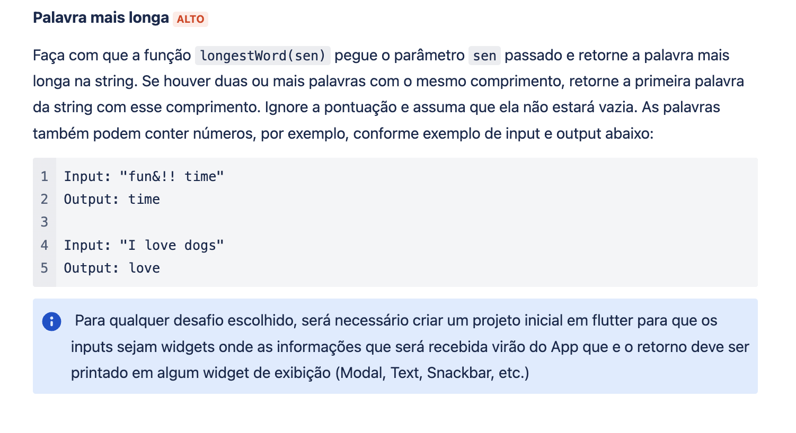

# desafio-justa

Olá!
Nesse repositório você encontrará a resolução do desafio do processo seletivo da Justa.

Inicialmente, foi apresentado o seguinte problema:

Ao alcançar a solução, tal resultado devia ser apresentado na tela, devendo conter assim:
- 1 TextField para receber input
- 1 Button para acionar a função
- 1 Text para expor output na tela

Testes e customização não foram solicitados, porém realizei ambos.
